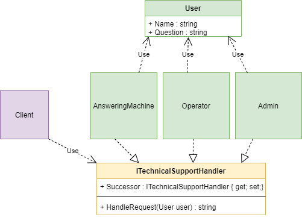

"Chain of Responsibility" is a behavioral design pattern that allows a request to be passed along a chain of handlers, and these handlers themselves decide to process the request or pass on to another handler.

## When we need this
- When we need to split complex request processing logic into multiple handlers
- When the request will be processed differently
- When the order of processing a request is not known.

## Real life example
> There is a foreigner, translators (processors), document (request). When a foreigner give a document to translator, the translator looks to see if he can translate the document, if yes, he translates, no, he transfers it further, and until the translators run out, everyone can transfer the document.

## Diagram

pros
- SRP - classes that call and execute operations are independent of each other.
- OSP - It is easy to extend handlers without touching the previous ones.
- We control the order of processing requests.

cons
- The request can be lost if no handler can handle it