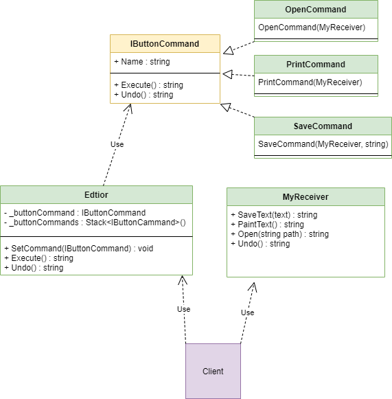

***

***

Command - disign pattern that turns requests into objects, these requests can be queued, and removed from the queue.

---

## When need use this pattern:

- When it is necessary to provide a queue of requests and cancellations.
- When it is necessary to encapsulate the logic of accepting requests and their execution.

---

## Diagram:

---

### pros:

- Easy add and undo system
- Single Responsibility Principle: we remove the direct dependence of causing objects and executing objects
- Open/closed principle: new commands can be easily created without breaking the client code)

### cons:

- The number classes is increasing

I readed and taked example here https://refactoring.guru/design-patterns/command

If I am wrong somewhere, correct me.
___