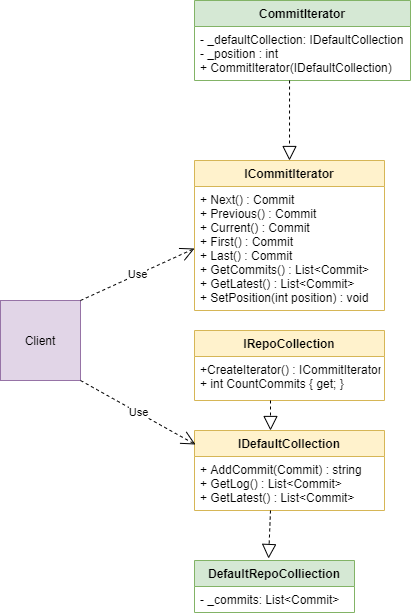

"Iterator" is a behavioral design pattern that provides an interface for accessing all elements of an object without exposing its structure.

> C # already has such IEnumerator / IEnumerable interfaces
> IEnumerator - functionality for iterating over objects in a container.
> IEnumerable - Gets an iterator for an object type.

## When we need this

- When you need to walk around an object and at the same time not reveal its structure.
- When we need different algorithms for traversing data structures.

## Real life example
We have a bank (collection) manager (iterator) client (client). The client turns to the manager with a request to withdraw money, the manager takes the money from the bank, gives it to the client. If the client himself took money from the bank, he could break something.

## Diagram

pros:
- Various ways to implement traversal of data structures,
- Ability to walk around the object without revealing the structure of the object.
- OCP - Easily extend iterators and collections.

cons:
- If the algorithm is simple, this pattern is useless.