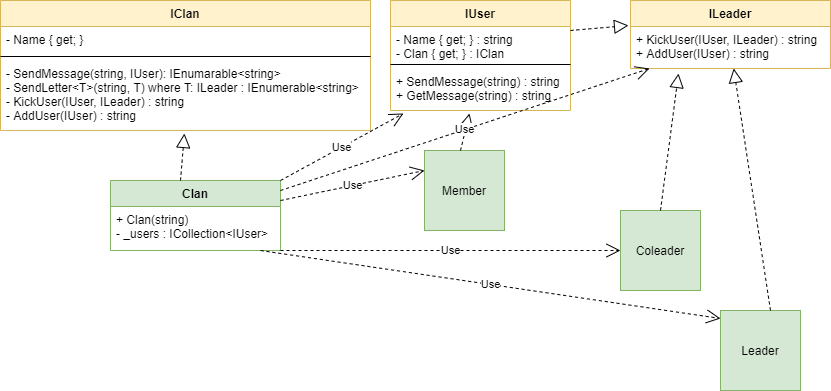

"Mediator" is a behavior design pattern that takes care of all the connections between objects.

> I decided to implement a simplified chat from my childhood game "Clash of clans"

## When we need this
* When we have a lot of tangled connections between objects and we need to collect them in one place.
* When we want to reuse objects.
* When we should easily change objects and at the same time not depend on connections.

## Real life example

> There is a farmer, a ketchup plant, a store (objects) and a distribution manager (Mediator) A farmer grows food, the plant produces ketchup, a store sells ketchup, and they all do not interact with each other, this is done by the manager who installs communication.

## Diagram

pros

* SRP - the unification of objects occurs in one place
* OSP - Easily replace mediator's without touching objects
* Reducing the relationship between objects
* Objects can be easily used in other places

cons

* The mediator knows and does too much and is God Object.