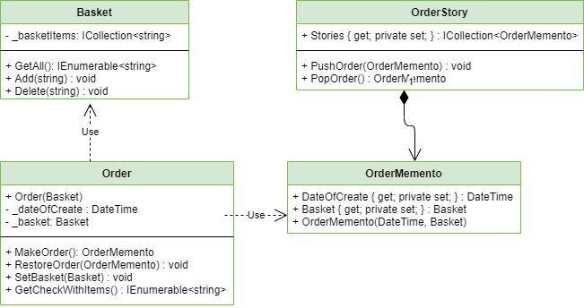

"Memento" - is a behavior design pattern that lets save and restore object state, without revealing details object.

## When we need this
* When we need to store the state of an object
* When we shouldn't break the encapsulation of the object.

## Real life example

> There is a person (Originator) a bag (Memento) and a robot (Caretaker) - A person has things, he can put them into the bag and give the bag to the robot. In case we need to return things, we ask the robot to give the bag and we take things from there. The robot itself cannot take or put things in the bag

> In C# can also use serialization and deserialization

## Diagram

pros
* We do not break the encapsulation of the Originator object

cons
* To much RAM goes to waste while saving state
* Inflates the number of classes
* Serialization and deserialization can be used