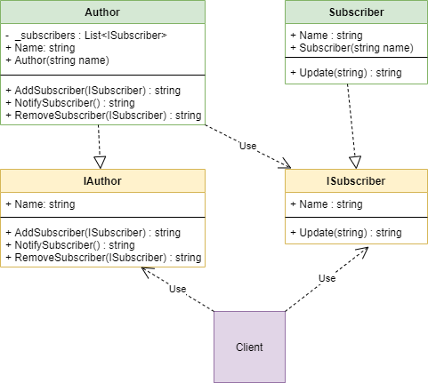

***

***

Observer - a behavioral design pattern that uses a one-to-many relationship, allows objects (observers) to monitor and respond to the events of other object (observable).

C# already has an implementation of this pattern - events. But as an interest, I decided to see how the events are implemented inside

---

## When need use this pattern:

- When there is one observable object, which should send something to other observers. and observers must accept and somehow react to this.
- When the number of observers is not known

---

## Diagram:

---

### pros:

- Open/closed principle  is met
- Observers are independent of the implementation of the observable, and vice versa.
- At runtime, you can subscribe and unsubscribe observers

### cons:

- It is impossible to control in what order the observers will be notified

I readed here https://refactoring.guru/design-patterns/observer

If I am wrong somewhere, correct me.
___