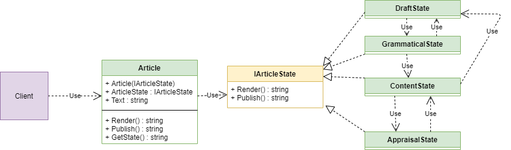

"State" is a behavior design pattern, that allows an object to change its behavior depending on its internal state.

> Instead of writing many if operators, we can move these conditions (state) into separate classes.

## When we need this

- When we have a huge number of conditions in the class, and when they need to be easily changed.
- When we want the state to change in runtime

> The difference between the state and strategy pattern is that there is no connection between the implementation classes in the strategy, but in the state there is.

## Diagram

pros:
- SRP - Each class has only 1 axis of change.
- OCP - To add new states, we don't need to change existing code.

cons:
- Not justified, if are little conditions, as it unnecessarily increases the code