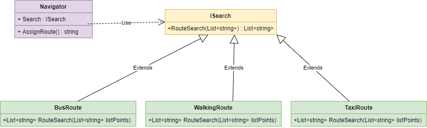

***

***

"Strategy " (behavioral design pattern) - this is when we define a family of similar algorithms, encapsulate their logic and thereby ensure interchangeability both at the stage of building a program and at runtime.

---

## When need use this pattern:

- When do we need to change the behavior of objects at runtime
- When we need to encapsulate the logic of the algorithm
- When we have several related classes that do the same task but in their own way
---

## Diagram:

---

### pros:

- Replacing algorithms at runtime
- Reali provides the principle of openness / closedness
- Isolation of implementation algorithms

### cons:

- The amount of code is increasing
- The client code should be aware of the difference between strategies

I readed here https://refactoring.guru/design-patterns/strategy

If I am wrong somewhere, correct me.
___