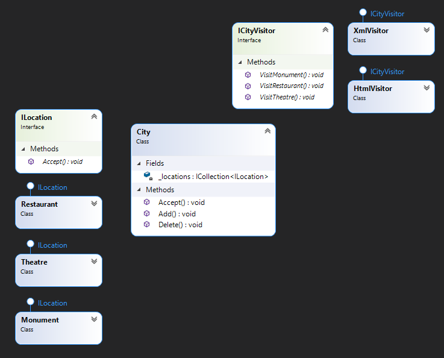

"visitor" - is a behavior design pattern that adds new functionality to an existing class without changing the existing class structure.

> I think that in C # the visitor is an anti-pattern because we have extension methods that can solve this problem in a more efficient way.

## When we need this:
* When there are many objects with different interfaces and it is required to perform operations on all of them
* When it is impossible to change the structure of ready-made classes
* When you need to cleanse logic from auxiliary behavior

## Diagram

pros
* OSP - add new behaviors without changing existing behaviors
* SRP - Each behavior has only 1 axis of change

cons
* It is necessary to change the behavior of the visitor every time the structure of the classes changes
* If fields and methods are closed, the visitor cannot work with them
* C# already has extension methods

I took example from https://refactoring.guru/design-patterns/visitor