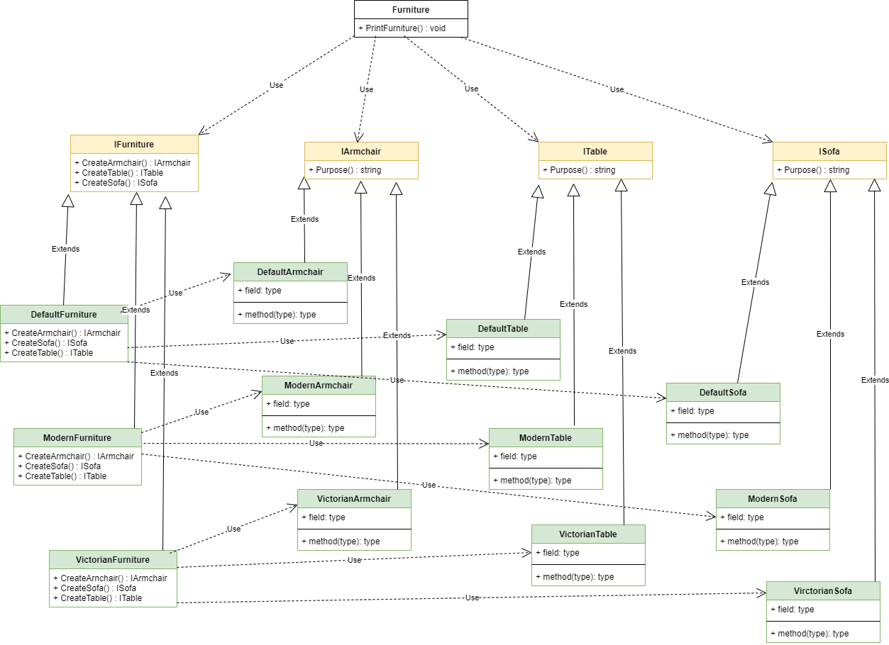

***

***

An "abstract factory" is a generative design pattern that allows families to be created related objects without being tied to specific classes of objects being created.

In other words, this is when we abstract from the implementation, create interconnected abstractions and use abstractions to manage objects in the client code.

---

## Diagram:

---

### pros:

- Ensures the compatibility of the created products.
- Eliminates client code from binding to specific product classes.
- Simplifies the addition of new products to the program.
- Implements the open/close principle.

### cons:

- It complicates the program code due to the introduction of many additional classes.
- Requires all types of products in every variation.
- It is difficult to expand (for example, it will be difficult to add new furniture) and because of the extensions, the principle of open/close principle is violated.

I took example from https://refactoring.guru/design-patterns/abstract-factory

If I am wrong somewhere, correct me.
___