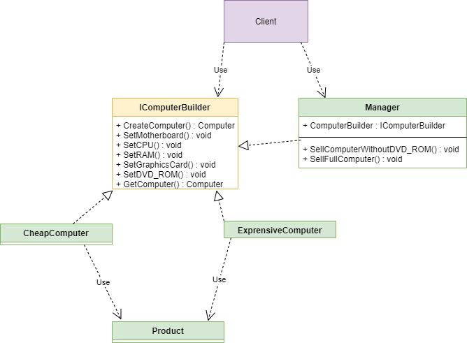

***

***

A "Builder" is a generative design pattern that allows you to divide the creation of a complex object into several stages, which increases the simplicity of the code

---

## application:

- When creating an object should not depend on parts
- When we need different variations of an object.
---

## Diagram:

---

### pros:

- can be reused code builder
- We observe the first principle of solid by isolating logic into convenient parts.
- Convenient component interchangeability

### cons:

- The amount of code is increasing

I readed here https://refactoring.guru/design-patterns/builder

If I am wrong somewhere, correct me.
___