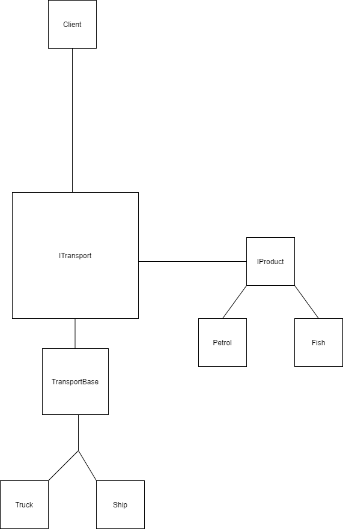

***

---

"Factory method" - is a method in which we create an interface for the parent, and from this parent we create descendants which change the type of objects created.

Let's imagine that we have a factory for the production of products, and we deliver these products using transport. To get rid of this strict dependence on transport, we use the "factory method" pattern. I tried to implement such a factory in this program and now there is no problem in extending the transport.

## Diagram

I took example from
https://refactoring.guru/design-patterns/factory-method

If I am wrong somewhere, correct me.

___