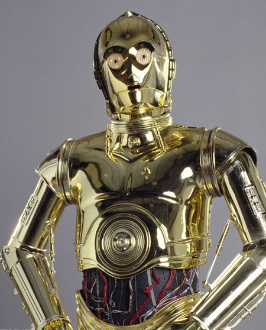
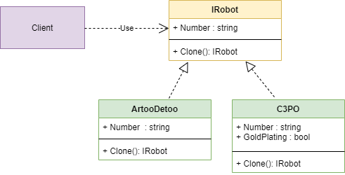

***

***

Before studying this pattern, I would advise you to remember (learn) that there are 2 types variables:
Variable values are those variables that have a fixed size (int, double, bool, etc.)
Reference values are those variables that are stored on the heap, and the stack itself stores references to a memory area. (string, class)

For the Variable values, the pattern is not needed, since we are copying another value on the stack,

BUT if we copy the reference variable, we copy the pointer to the memory area, and accordingly, when the value in one of the clones changes, the values will change for all objects. So the prototype pattern solves this problem, and changes values only for clones.

---

A "prototype" is a pattern that allows you to create new objects based on previously created prototype objects.

I made a project that makes helper robots from "star wars", and with the help of cloning we can create new ones referring to the old ones without changing the old ones.

---

## Diagram:

---

### pros:

- Clone new prototypes, we do not break old ones.
- You can clone objects without binding to specific classes.
- We comply with the DRY principle.
- Flexible management of the process of creating new objects.

### cons:

- Each type of product being executed must implement the clone() operation. In case a deep copy of an object is required (the object contains links or pointers to other objects).

I took example from https://refactoring.guru/design-patterns/prototype

If I am wrong somewhere, correct me.
___