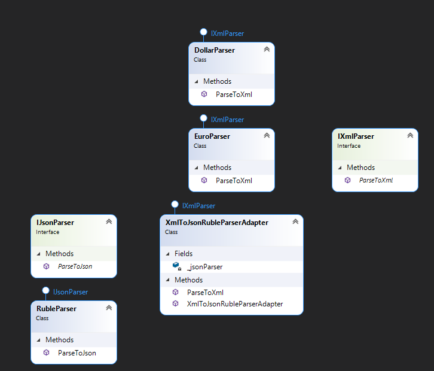

"Adapter" - is a structural design pattern that lets allows you to change 1 interface to another without changing the interface itself

## When we need this
* When it is necessary to use an existing class, but its interface does not match our
* When we don't want to copy-paste someone else's code, but want use it

## Diagram

pros
* SRP - Adapter and BL work separately
* OCP - Adding new adapters does not affect the client code in any way

cons
* Sometimes it's easier to change the interface of someone else's class than to use a lot of new interfaces and classes

I read and took an example here: https://refactoring.guru/design-patterns/adapter