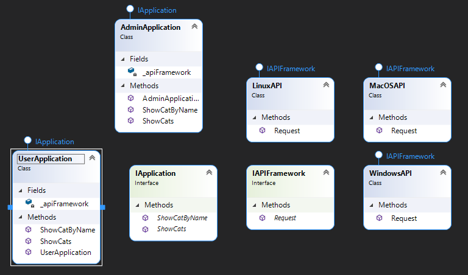

"Bridge" - it is a structural design pattern that split implementation and abstraction of a large object, which can be modified independently of each other.

## When we need this
* When to change the abstraction without binding to the implementation

## Diagram

pros
* OCP - New abstractions and implementations are added rather than extended
* SRP - abstractions and implementations are in different hierarchies
* Client work with abstractions

cons
* It will be superfluous for a highly cohesive class

I readed and take example here: https://refactoring.guru/design-patterns/bridge