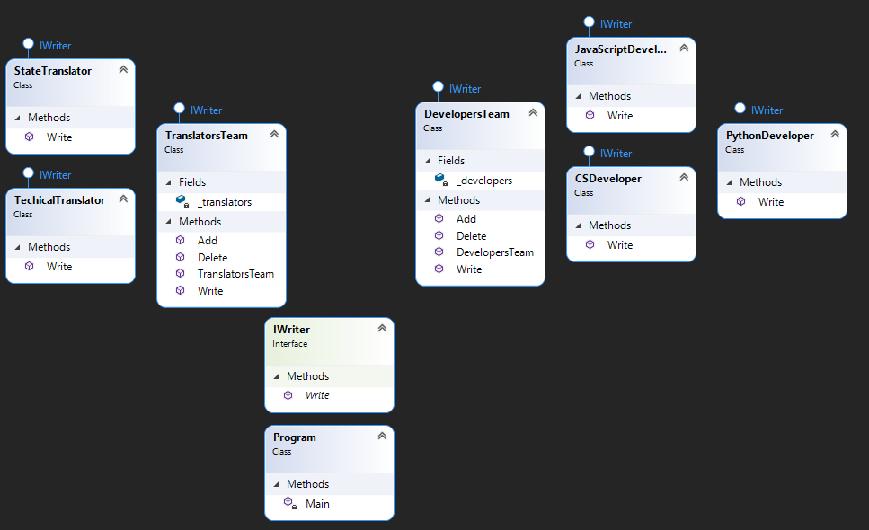

Composite - is a structural design pattern that lets a tree structure, while working with this structure as with separate objects

## When we need this
* When we have a complex tree structure and need to break it down into hierarchies
* When you need to manage objects and their component parts in the same way

## Diagram

## Real life example
> We have a tree that has branches (components) and leaves (objects), a branch can have both branches and leaves

pros
* SRP - each component or object has only 1 axis of change
* OCP - we expand components and objects without changing the existing code
* Hiding the hierarchy from the client using the interface

minuses
The interface is too general, which can sometimes make it difficult to understand

I read here: https://refactoring.guru/design-patterns/composite