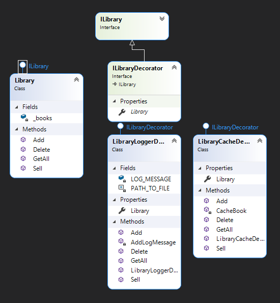

"Decorator" is a structural design pattern that allows you to attach new behaviors without adding them to the current code, but by creating new wrappers.

## When we need this
- When you need to dynamically add new functionality
- When it is not desirable to use inheritance

## Diagram

pros
* SRP each decorator has only 1 axis of change
* OSP easy addition of new features without changing the current code
* Decorators can be wrapped unlimited times in each other
* Dynamically add and remove decorators
* We do not use inheritance

cons
* Difficult to remove decorator from chain