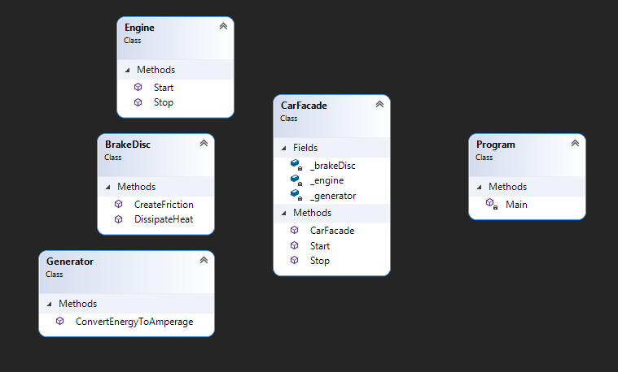

"Facade" - is a structural design pattern that lets comfortable interface for client, hiding complex system

## When we need this
* When you need to hide system complex interactions, into a interface for client

## Diagram

pros
* Hiding implementation details from the client

cons
* If the facade is too large, it turns into God object
* Violation of the OCP principle - to extend the facade, you need to change the existing code

I read here: https://refactoring.guru/design-patterns/facade