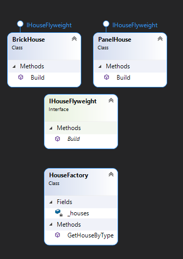

"Flyweight" - is a structural design pattern that allows a large number of objects to be placed in RAM

## When we need this
* When you need a lot of creation of the same objects

## Diagram

pros
* Save RAM

cons
* We need time for find context
* Complicates the program code

I readed here: https://refactoring.guru/design-patterns/flyweight