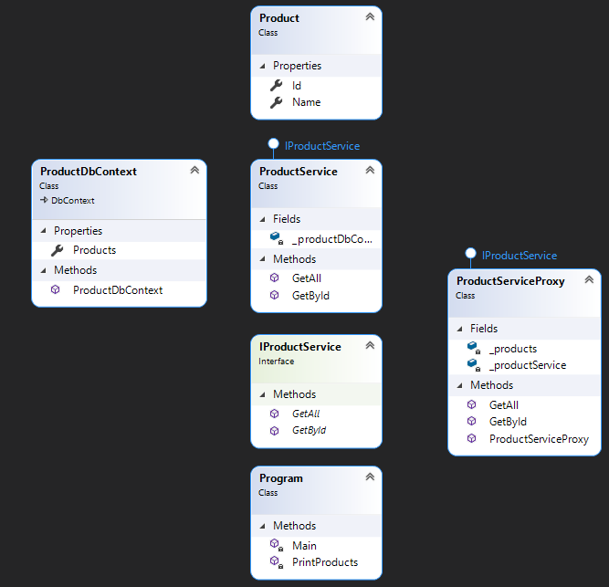

"Proxy" - it is a structural design pattern that gives a surrogate object that replaces the complex object.

## When we need this
* When you need to reduce the load on the server when transferring data
* When you need to protect against an object from accidental handling

## Diagram

pros
* The client does not know about the proxy, since the subject and the proxy have the same interface
* OCP - we are expanding new proxies without changing the current
* Reducing the load on the subject

cons
* The first request to a proxy may take longer than to a subject

I read here: https://refactoring.guru/design-patterns/proxy